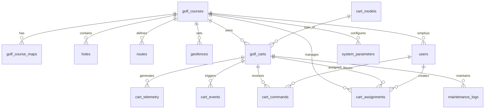
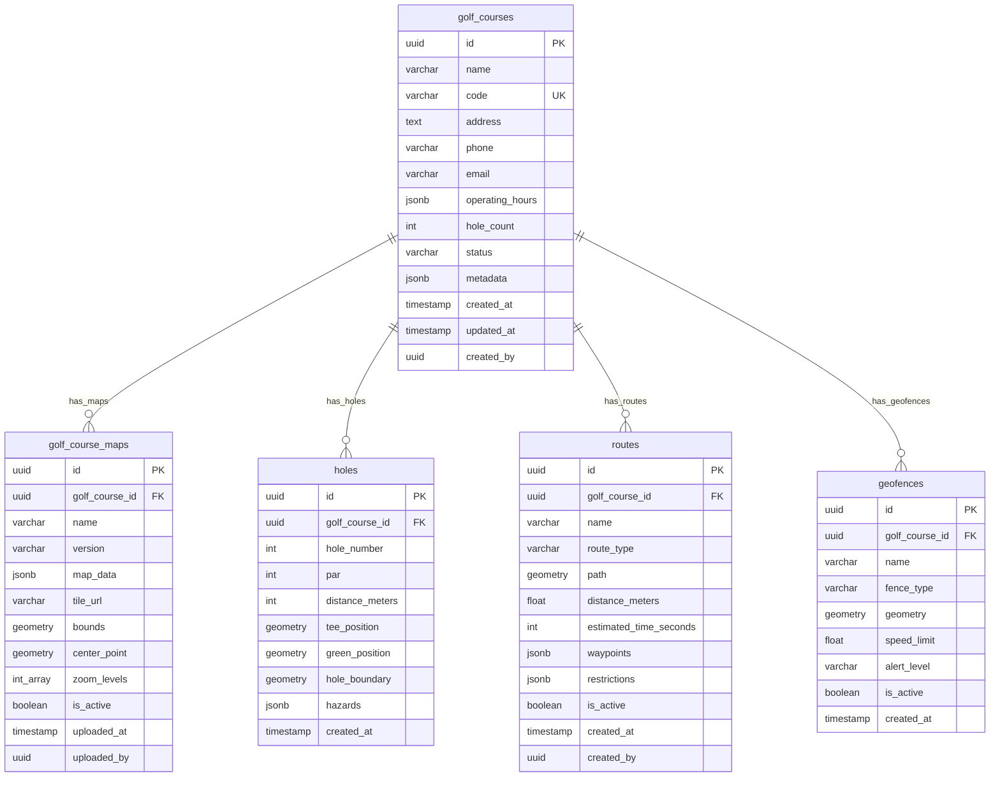
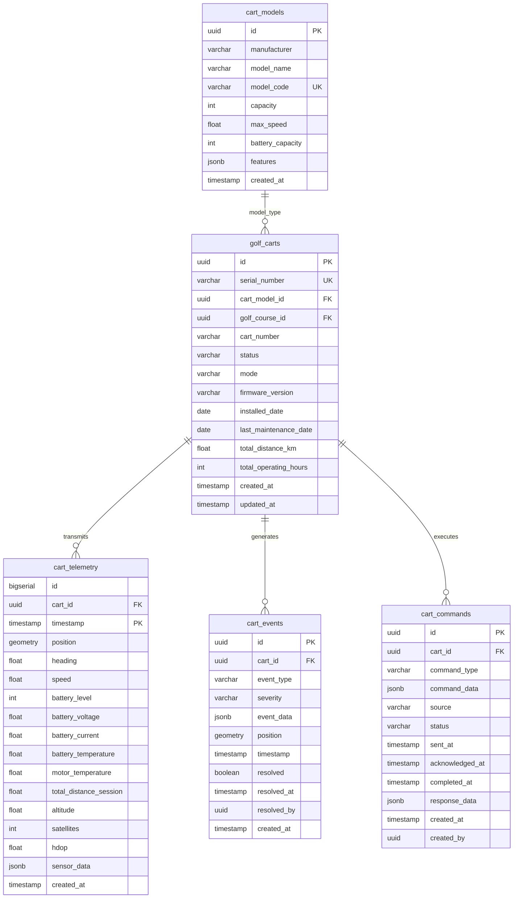
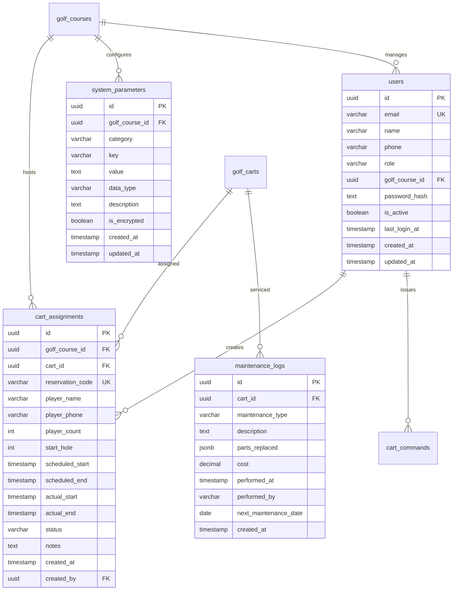
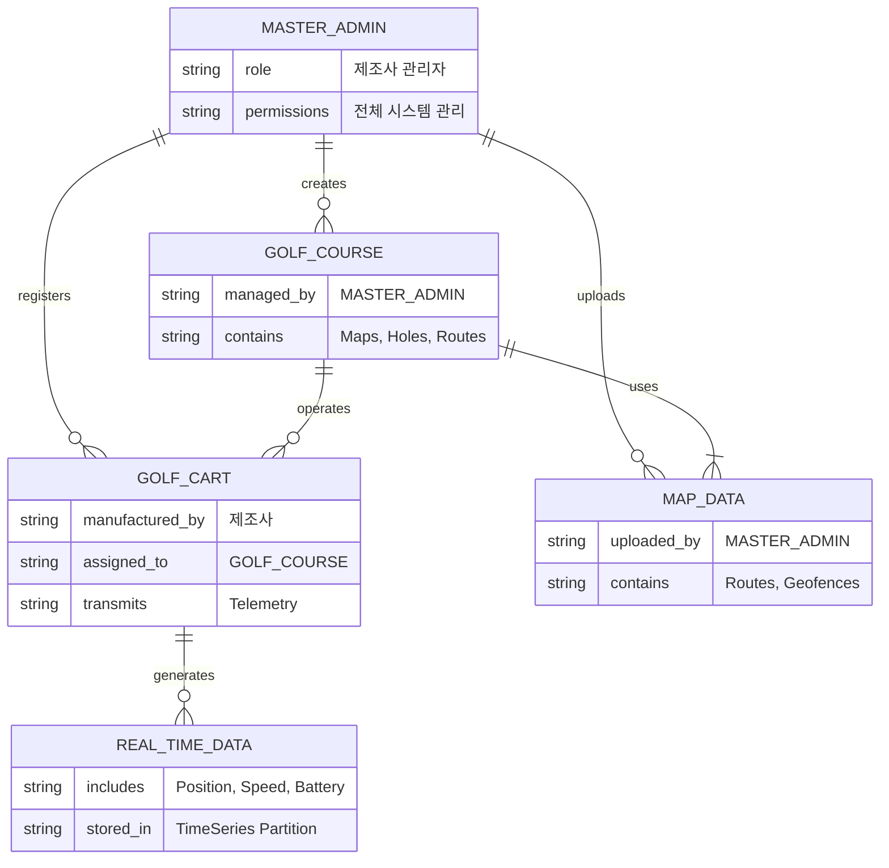
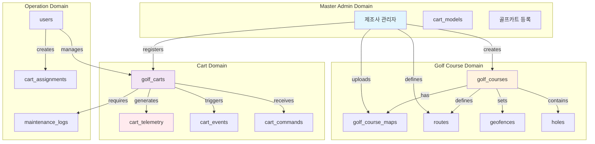
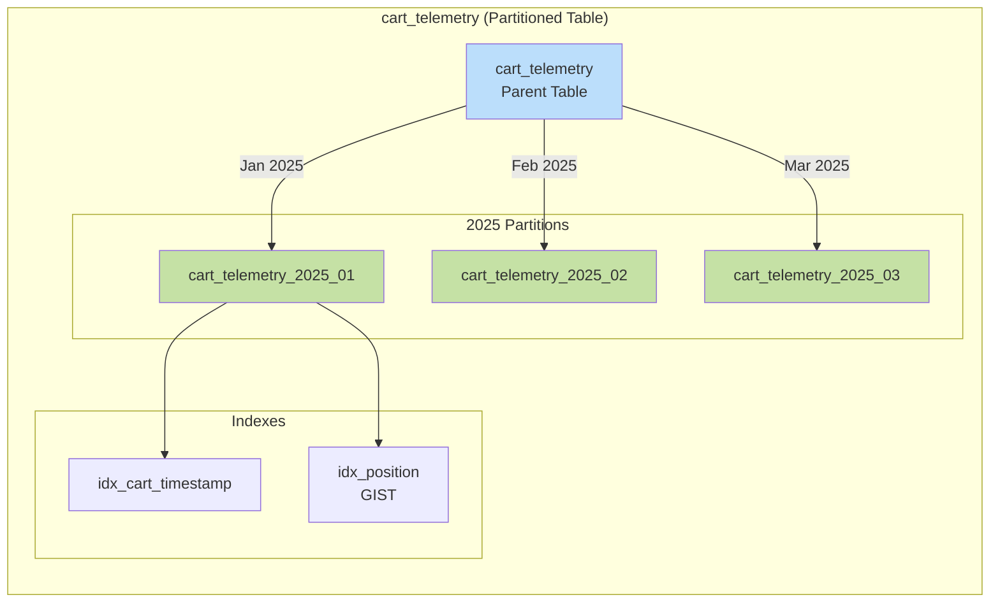

전체 ERD (Overview)

```mermaid
erDiagram
    %% 골프장 관리
    golf_courses ||--o{ golf_course_maps : "has"
    golf_courses ||--o{ holes : "contains"
    golf_courses ||--o{ routes : "defines"
    golf_courses ||--o{ geofences : "sets"
    golf_courses ||--o{ golf_carts : "owns"
    golf_courses ||--o{ cart_assignments : "manages"
    golf_courses ||--o{ users : "employs"
    golf_courses ||--o{ system_parameters : "configures"

    %% 카트 관리
    cart_models ||--o{ golf_carts : "type_of"
    golf_carts ||--o{ cart_telemetry : "generates"
    golf_carts ||--o{ cart_events : "triggers"
    golf_carts ||--o{ cart_commands : "receives"
    golf_carts ||--o{ cart_assignments : "assigned_to"
    golf_carts ||--o{ maintenance_logs : "maintains"

    %% 사용자 관리
    users ||--o{ cart_commands : "issues"
    users ||--o{ cart_assignments : "creates"
```

상세 ERD - 골프장 도메인

```mermaid
erDiagram
    golf_courses {
        uuid id PK
        varchar name
        varchar code UK
        text address
        varchar phone
        varchar email
        jsonb operating_hours
        int hole_count
        varchar status
        jsonb metadata
        timestamp created_at
        timestamp updated_at
        uuid created_by
    }

    golf_course_maps {
        uuid id PK
        uuid golf_course_id FK
        varchar name
        varchar version
        jsonb map_data
        varchar tile_url
        geometry bounds
        geometry center_point
        int_array zoom_levels
        boolean is_active
        timestamp uploaded_at
        uuid uploaded_by
    }

    holes {
        uuid id PK
        uuid golf_course_id FK
        int hole_number
        int par
        int distance_meters
        geometry tee_position
        geometry green_position
        geometry hole_boundary
        jsonb hazards
        timestamp created_at
    }

    routes {
        uuid id PK
        uuid golf_course_id FK
        varchar name
        varchar route_type
        geometry path
        float distance_meters
        int estimated_time_seconds
        jsonb waypoints
        jsonb restrictions
        boolean is_active
        timestamp created_at
        uuid created_by
    }

    geofences {
        uuid id PK
        uuid golf_course_id FK
        varchar name
        varchar fence_type
        geometry geometry
        float speed_limit
        varchar alert_level
        boolean is_active
        timestamp created_at
    }

    golf_courses ||--o{ golf_course_maps : "has_maps"
    golf_courses ||--o{ holes : "has_holes"
    golf_courses ||--o{ routes : "has_routes"
    golf_courses ||--o{ geofences : "has_geofences"
```

상세 ERD - 카트 도메인

```mermaid
erDiagram
    cart_models {
        uuid id PK
        varchar manufacturer
        varchar model_name
        varchar model_code UK
        int capacity
        float max_speed
        int battery_capacity
        jsonb features
        timestamp created_at
    }

    golf_carts {
        uuid id PK
        varchar serial_number UK
        uuid cart_model_id FK
        uuid golf_course_id FK
        varchar cart_number
        varchar status
        varchar mode
        varchar firmware_version
        date installed_date
        date last_maintenance_date
        float total_distance_km
        int total_operating_hours
        timestamp created_at
        timestamp updated_at
    }

    cart_telemetry {
        bigserial id
        uuid cart_id FK
        timestamp timestamp PK
        geometry position
        float heading
        float speed
        int battery_level
        float battery_voltage
        float battery_current
        float battery_temperature
        float motor_temperature
        float total_distance_session
        float altitude
        int satellites
        float hdop
        jsonb sensor_data
        timestamp created_at
    }

    cart_events {
        uuid id PK
        uuid cart_id FK
        varchar event_type
        varchar severity
        jsonb event_data
        geometry position
        timestamp timestamp
        boolean resolved
        timestamp resolved_at
        uuid resolved_by
        timestamp created_at
    }

    cart_commands {
        uuid id PK
        uuid cart_id FK
        varchar command_type
        jsonb command_data
        varchar source
        varchar status
        timestamp sent_at
        timestamp acknowledged_at
        timestamp completed_at
        jsonb response_data
        timestamp created_at
        uuid created_by
    }

    cart_models ||--o{ golf_carts : "model_type"
    golf_carts ||--o{ cart_telemetry : "transmits"
    golf_carts ||--o{ cart_events : "generates"
    golf_carts ||--o{ cart_commands : "executes"
```

상세 ERD - 운영 도메인

```mermaid
erDiagram
    users {
        uuid id PK
        varchar email UK
        varchar name
        varchar phone
        varchar role
        uuid golf_course_id FK
        text password_hash
        boolean is_active
        timestamp last_login_at
        timestamp created_at
        timestamp updated_at
    }

    cart_assignments {
        uuid id PK
        uuid golf_course_id FK
        uuid cart_id FK
        varchar reservation_code UK
        varchar player_name
        varchar player_phone
        int player_count
        int start_hole
        timestamp scheduled_start
        timestamp scheduled_end
        timestamp actual_start
        timestamp actual_end
        varchar status
        text notes
        timestamp created_at
        uuid created_by FK
    }

    maintenance_logs {
        uuid id PK
        uuid cart_id FK
        varchar maintenance_type
        text description
        jsonb parts_replaced
        decimal cost
        timestamp performed_at
        varchar performed_by
        date next_maintenance_date
        timestamp created_at
    }

    system_parameters {
        uuid id PK
        uuid golf_course_id FK
        varchar category
        varchar key
        text value
        varchar data_type
        text description
        boolean is_encrypted
        timestamp created_at
        timestamp updated_at
    }

    users ||--o{ cart_assignments : "creates"
    users ||--o{ cart_commands : "issues"
    golf_carts ||--o{ cart_assignments : "assigned"
    golf_carts ||--o{ maintenance_logs : "serviced"
    golf_courses ||--o{ cart_assignments : "hosts"
    golf_courses ||--o{ system_parameters : "configures"
    golf_courses ||--o{ users : "manages"
```

주요 관계 요약 (Simplified)

```mermaid
erDiagram
    MASTER_ADMIN {
        string role "제조사 관리자"
        string permissions "전체 시스템 관리"
    }

    GOLF_COURSE {
        string managed_by "MASTER_ADMIN"
        string contains "Maps, Holes, Routes"
    }

    GOLF_CART {
        string manufactured_by "제조사"
        string assigned_to "GOLF_COURSE"
        string transmits "Telemetry"
    }

    MAP_DATA {
        string uploaded_by "MASTER_ADMIN"
        string contains "Routes, Geofences"
    }

    REAL_TIME_DATA {
        string includes "Position, Speed, Battery"
        string stored_in "TimeSeries Partition"
    }

    MASTER_ADMIN ||--o{ GOLF_COURSE : "creates"
    MASTER_ADMIN ||--o{ GOLF_CART : "registers"
    MASTER_ADMIN ||--o{ MAP_DATA : "uploads"
    GOLF_COURSE ||--o{ GOLF_CART : "operates"
    GOLF_COURSE ||--|{ MAP_DATA : "uses"
    GOLF_CART ||--o{ REAL_TIME_DATA : "generates"
```

데이터 플로우 중심 ERD

```mermaid
graph TB
    subgraph "Master Admin Domain"
        MA[제조사 관리자]
        CM[cart_models]
        GC_REG[골프카트 등록]
    end

    subgraph "Golf Course Domain"
        GC[golf_courses]
        MAP[golf_course_maps]
        ROUTE[routes]
        GEO[geofences]
        HOLE[holes]
    end

    subgraph "Cart Domain"
        CART[golf_carts]
        TEL[cart_telemetry]
        EVT[cart_events]
        CMD[cart_commands]
    end

    subgraph "Operation Domain"
        USER[users]
        ASSIGN[cart_assignments]
        MAINT[maintenance_logs]
    end

    MA -->|creates| GC
    MA -->|uploads| MAP
    MA -->|defines| ROUTE
    MA -->|registers| CART

    GC -->|has| MAP
    GC -->|contains| HOLE
    GC -->|defines| ROUTE
    GC -->|sets| GEO

    CART -->|generates| TEL
    CART -->|triggers| EVT
    CART -->|receives| CMD

    USER -->|manages| CART
    USER -->|creates| ASSIGN
    CART -->|requires| MAINT

    style MA fill:#e1f5fe
    style GC fill:#fff3e0
    style CART fill:#f3e5f5
    style TEL fill:#ffebee
```

시계열 데이터 파티셔닝 구조

```mermaid
graph LR
    subgraph "cart_telemetry (Partitioned Table)"
        PARENT[cart_telemetry<br/>Parent Table]

        subgraph "2025 Partitions"
            P202501[cart_telemetry_2025_01]
            P202502[cart_telemetry_2025_02]
            P202503[cart_telemetry_2025_03]
        end

        subgraph "Indexes"
            IDX1[idx_cart_timestamp]
            IDX2[idx_position<br/>GIST]
        end
    end

    PARENT -->|Jan 2025| P202501
    PARENT -->|Feb 2025| P202502
    PARENT -->|Mar 2025| P202503

    P202501 --> IDX1
    P202501 --> IDX2

    style PARENT fill:#bbdefb
    style P202501 fill:#c5e1a5
    style P202502 fill:#c5e1a5
    style P202503 fill:#c5e1a5
```
