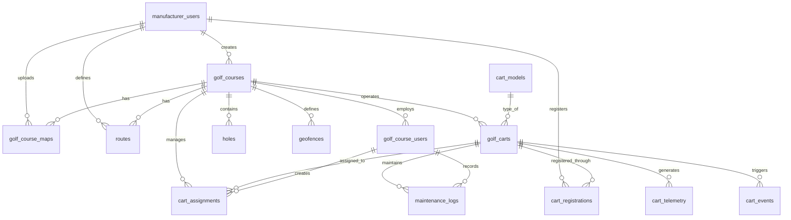
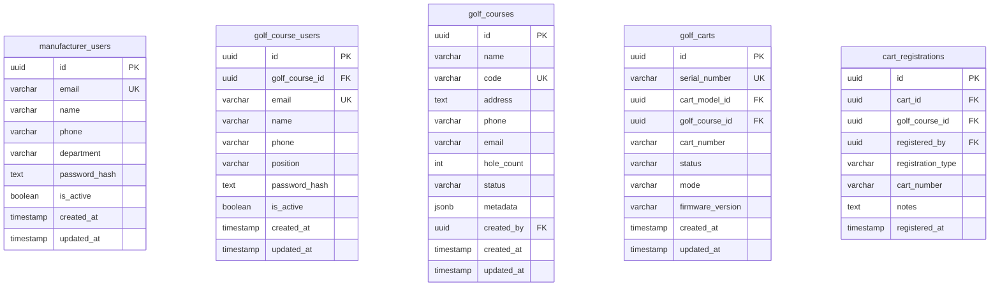
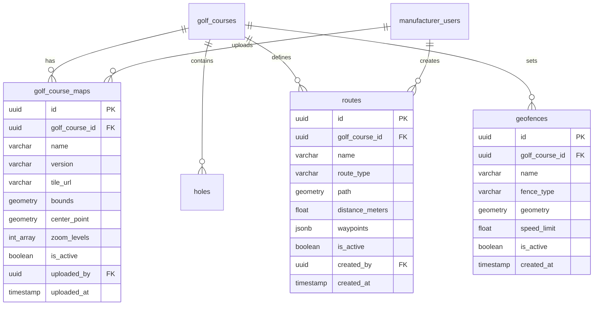

## 1. 간소화된 ERD

```mermaid
erDiagram
    %% 사용자 관리
    manufacturer_users ||--o{ golf_courses : "creates"
    manufacturer_users ||--o{ golf_course_maps : "uploads"
    manufacturer_users ||--o{ routes : "defines"
    manufacturer_users ||--o{ cart_registrations : "registers"

    golf_courses ||--o{ golf_course_users : "employs"
    golf_courses ||--o{ golf_course_maps : "has"
    golf_courses ||--o{ holes : "contains"
    golf_courses ||--o{ routes : "has"
    golf_courses ||--o{ geofences : "defines"
    golf_courses ||--o{ golf_carts : "operates"
    golf_courses ||--o{ cart_assignments : "manages"

    %% 카트 관리
    cart_models ||--o{ golf_carts : "type_of"
    golf_carts ||--o{ cart_registrations : "registered_through"
    golf_carts ||--o{ cart_telemetry : "generates"
    golf_carts ||--o{ cart_events : "triggers"
    golf_carts ||--o{ cart_assignments : "assigned_to"
    golf_carts ||--o{ maintenance_logs : "maintains"

    golf_course_users ||--o{ cart_assignments : "creates"
    golf_course_users ||--o{ maintenance_logs : "records"
```

## 3.1 전체 시스템 구조

```mermaid
erDiagram
    manufacturer_users {
        uuid id PK
        varchar email UK
        varchar name
        varchar phone
        varchar department
        text password_hash
        boolean is_active
        timestamp created_at
        timestamp updated_at
    }

    golf_course_users {
        uuid id PK
        uuid golf_course_id FK
        varchar email UK
        varchar name
        varchar phone
        varchar position
        text password_hash
        boolean is_active
        timestamp created_at
        timestamp updated_at
    }

    golf_courses {
        uuid id PK
        varchar name
        varchar code UK
        text address
        varchar phone
        varchar email
        int hole_count
        varchar status
        jsonb metadata
        uuid created_by FK
        timestamp created_at
        timestamp updated_at
    }

    golf_carts {
        uuid id PK
        varchar serial_number UK
        uuid cart_model_id FK
        uuid golf_course_id FK
        varchar cart_number
        varchar status
        varchar mode
        varchar firmware_version
        timestamp created_at
        timestamp updated_at
    }

    cart_registrations {
        uuid id PK
        uuid cart_id FK
        uuid golf_course_id FK
        uuid registered_by FK
        varchar registration_type
        varchar cart_number
        text notes
        timestamp registered_at
    }
```

## 3.2 지도 및 경로 관계

```mermaid
erDiagram
    golf_courses ||--o{ golf_course_maps : "has"
    golf_courses ||--o{ holes : "contains"
    golf_courses ||--o{ routes : "defines"
    golf_courses ||--o{ geofences : "sets"
    manufacturer_users ||--o{ golf_course_maps : "uploads"
    manufacturer_users ||--o{ routes : "creates"

    golf_course_maps {
        uuid id PK
        uuid golf_course_id FK
        varchar name
        varchar version
        varchar tile_url
        geometry bounds
        geometry center_point
        int_array zoom_levels
        boolean is_active
        uuid uploaded_by FK
        timestamp uploaded_at
    }

    routes {
        uuid id PK
        uuid golf_course_id FK
        varchar name
        varchar route_type
        geometry path
        float distance_meters
        jsonb waypoints
        boolean is_active
        uuid created_by FK
        timestamp created_at
    }

    geofences {
        uuid id PK
        uuid golf_course_id FK
        varchar name
        varchar fence_type
        geometry geometry
        float speed_limit
        boolean is_active
        timestamp created_at
    }
```
