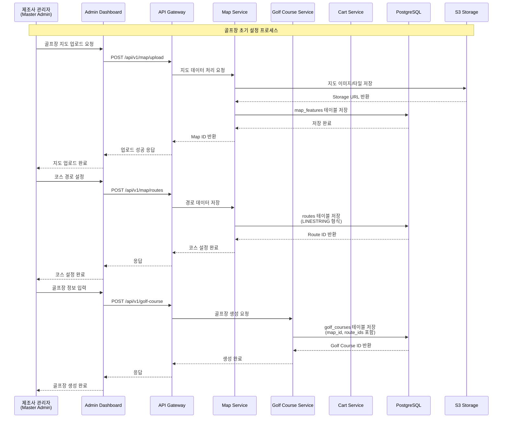
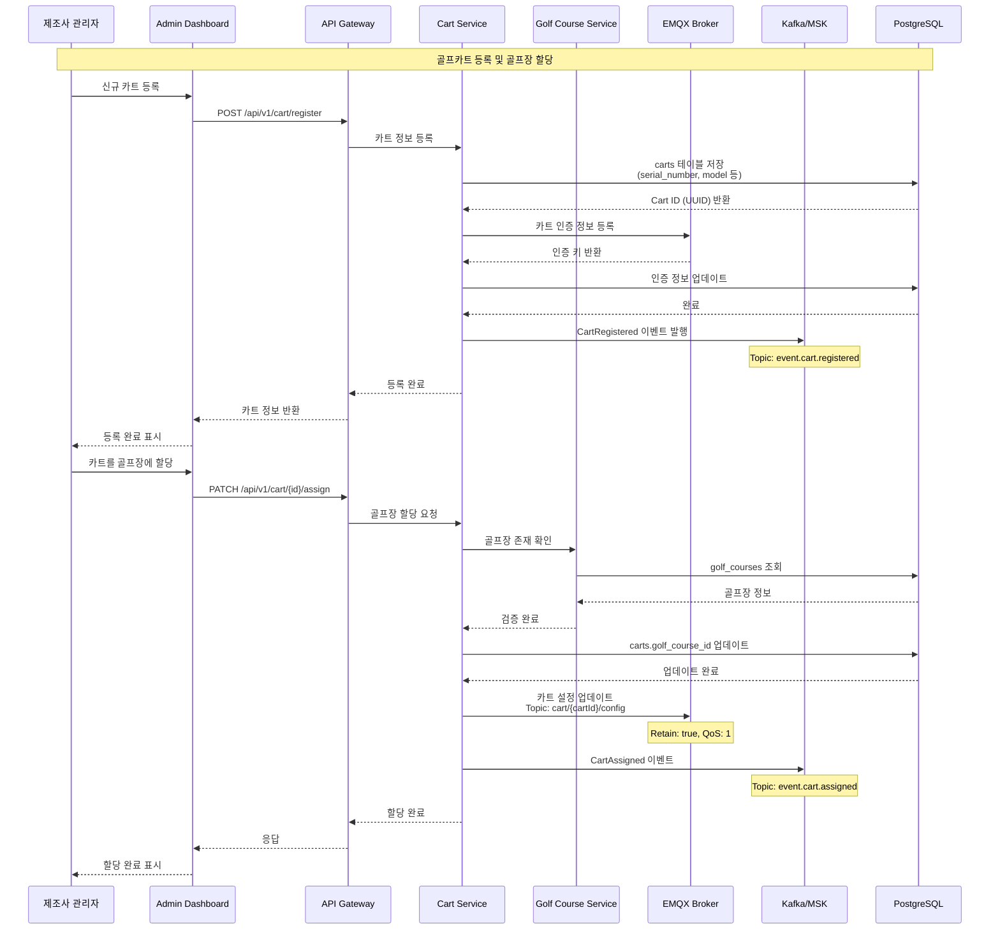
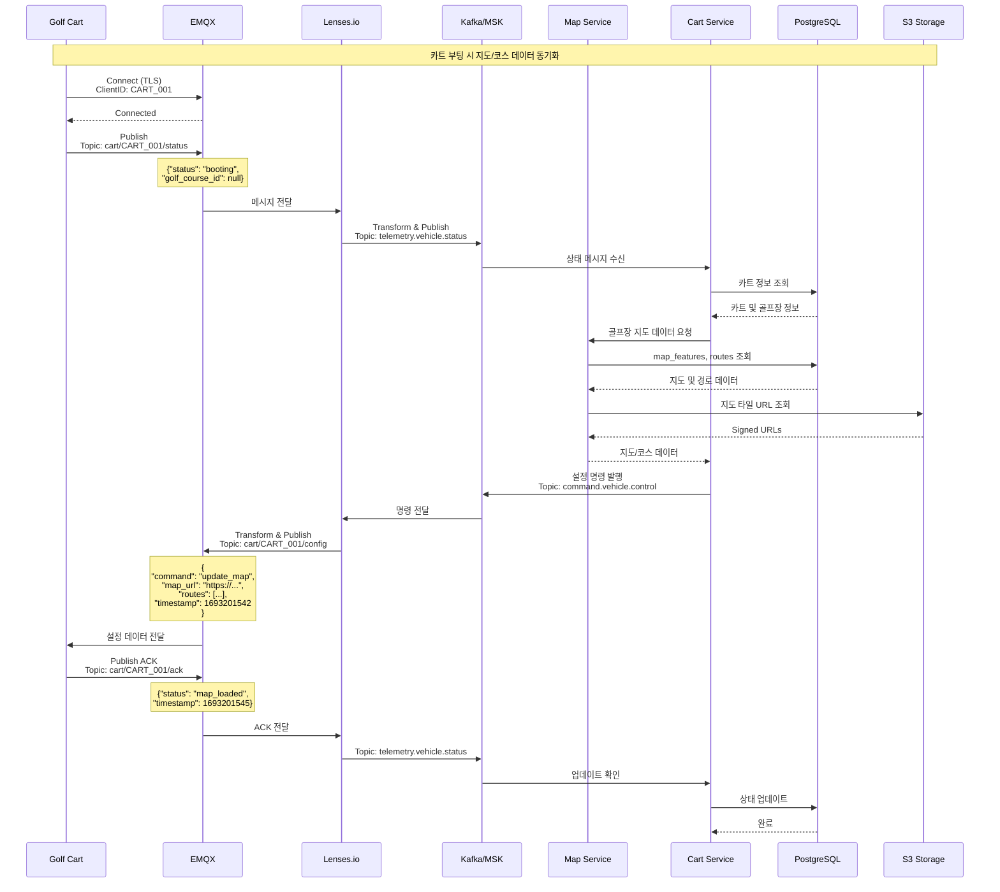
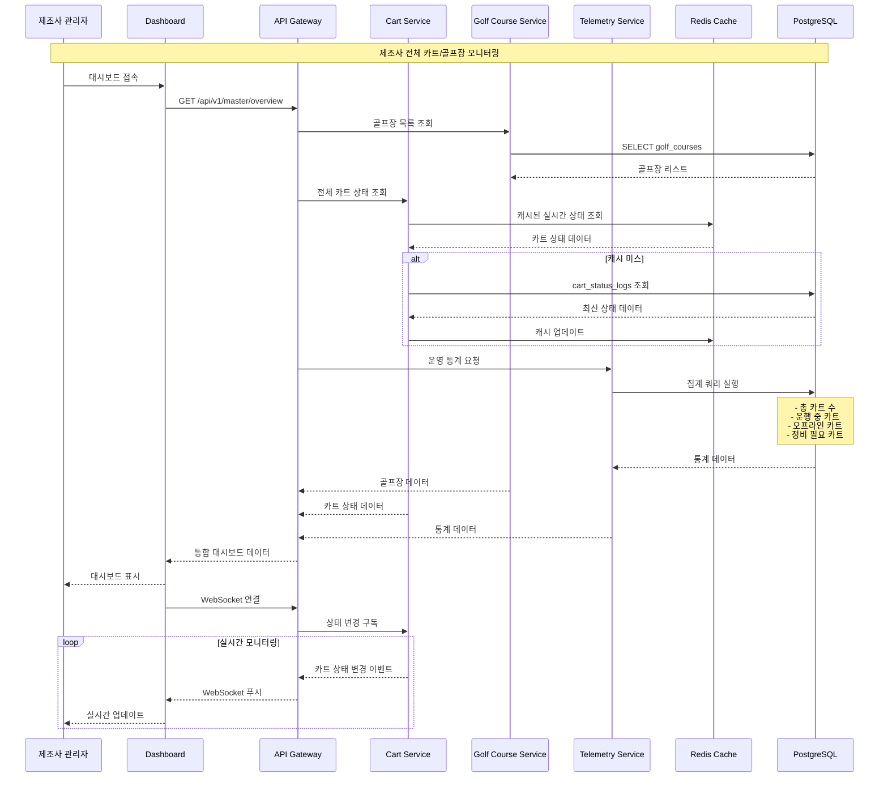

title 1. 골프장 초기 설정 시퀀스

```mermaid
sequenceDiagram
    participant MA as 제조사 관리자<br/>(Master Admin)
    participant UI as Admin Dashboard
    participant API as API Gateway
    participant MS as Map Service
    participant GS as Golf Course Service
    participant CS as Cart Service
    participant DB as PostgreSQL
    participant S3 as S3 Storage

        Note over MA,S3: 골프장 초기 설정 프로세스

        %% 1. 지도 데이터 업로드
        MA->>UI: 골프장 지도 업로드 요청
        UI->>API: POST /api/v1/map/upload
        API->>MS: 지도 데이터 처리 요청
        MS->>S3: 지도 이미지/타일 저장
        S3-->>MS: Storage URL 반환
        MS->>DB: map_features 테이블 저장
        DB-->>MS: 저장 완료
        MS-->>API: Map ID 반환
        API-->>UI: 업로드 성공 응답
        UI-->>MA: 지도 업로드 완료

        %% 2. 코스 설정
        MA->>UI: 코스 경로 설정
        UI->>API: POST /api/v1/map/routes
        API->>MS: 경로 데이터 저장
        MS->>DB: routes 테이블 저장<br/>(LINESTRING 형식)
        DB-->>MS: Route ID 반환
        MS-->>API: 코스 설정 완료
        API-->>UI: 응답
        UI-->>MA: 코스 설정 완료

        %% 3. 골프장 생성
        MA->>UI: 골프장 정보 입력
        UI->>API: POST /api/v1/golf-course
        API->>GS: 골프장 생성 요청
        GS->>DB: golf_courses 테이블 저장<br/>(map_id, route_ids 포함)
        DB-->>GS: Golf Course ID 반환
        GS-->>API: 생성 완료
        API-->>UI: 응답
        UI-->>MA: 골프장 생성 완료
```

title 2. 골프카트 등록 및 할당 시퀀스

```mermaid
sequenceDiagram
    participant MA as 제조사 관리자
    participant UI as Admin Dashboard
    participant API as API Gateway
    participant CS as Cart Service
    participant GS as Golf Course Service
    participant MQTT as EMQX Broker
    participant Kafka as Kafka/MSK
    participant DB as PostgreSQL

        Note over MA,DB: 골프카트 등록 및 골프장 할당

        %% 1. 골프카트 등록 (제조사)
        MA->>UI: 신규 카트 등록
        UI->>API: POST /api/v1/cart/register
        API->>CS: 카트 정보 등록
        CS->>DB: carts 테이블 저장<br/>(serial_number, model 등)
        DB-->>CS: Cart ID (UUID) 반환

        %% 2. MQTT 인증 정보 생성
        CS->>MQTT: 카트 인증 정보 등록
        MQTT-->>CS: 인증 키 반환
        CS->>DB: 인증 정보 업데이트
        DB-->>CS: 완료

        %% 3. 이벤트 발행
        CS->>Kafka: CartRegistered 이벤트 발행
        Note over Kafka: Topic: event.cart.registered

        CS-->>API: 등록 완료
        API-->>UI: 카트 정보 반환
        UI-->>MA: 등록 완료 표시

        %% 4. 골프장 할당
        MA->>UI: 카트를 골프장에 할당
        UI->>API: PATCH /api/v1/cart/{id}/assign
        API->>CS: 골프장 할당 요청

        %% 5. 할당 검증
        CS->>GS: 골프장 존재 확인
        GS->>DB: golf_courses 조회
        DB-->>GS: 골프장 정보
        GS-->>CS: 검증 완료

        %% 6. 할당 처리
        CS->>DB: carts.golf_course_id 업데이트
        DB-->>CS: 업데이트 완료

        %% 7. 카트 설정 동기화
        CS->>MQTT: 카트 설정 업데이트<br/>Topic: cart/{cartId}/config
        Note over MQTT: Retain: true, QoS: 1

        CS->>Kafka: CartAssigned 이벤트
        Note over Kafka: Topic: event.cart.assigned

        CS-->>API: 할당 완료
        API-->>UI: 응답
        UI-->>MA: 할당 완료 표시
```

title 3. 지도/코스 데이터 동기화 시퀀스

```mermaid
sequenceDiagram
    participant Cart as Golf Cart
    participant MQTT as EMQX
    participant Bridge as Lenses.io
    participant Kafka as Kafka/MSK
    participant MS as Map Service
    participant CS as Cart Service
    participant DB as PostgreSQL
    participant S3 as S3 Storage

        Note over Cart,S3: 카트 부팅 시 지도/코스 데이터 동기화

        %% 1. 카트 부팅 및 연결
        Cart->>MQTT: Connect (TLS)<br/>ClientID: CART_001
        MQTT-->>Cart: Connected

        %% 2. 카트 상태 보고
        Cart->>MQTT: Publish<br/>Topic: cart/CART_001/status
        Note over MQTT: {"status": "booting",<br/>"golf_course_id": null}

        MQTT->>Bridge: 메시지 전달
        Bridge->>Kafka: Transform & Publish<br/>Topic: telemetry.vehicle.status

        %% 3. 카트 정보 조회
        Kafka->>CS: 상태 메시지 수신
        CS->>DB: 카트 정보 조회
        DB-->>CS: 카트 및 골프장 정보

        %% 4. 지도/코스 데이터 준비
        CS->>MS: 골프장 지도 데이터 요청
        MS->>DB: map_features, routes 조회
        DB-->>MS: 지도 및 경로 데이터
        MS->>S3: 지도 타일 URL 조회
        S3-->>MS: Signed URLs

        %% 5. 카트에 설정 전송
        MS-->>CS: 지도/코스 데이터
        CS->>Kafka: 설정 명령 발행<br/>Topic: command.vehicle.control
        Kafka->>Bridge: 명령 전달
        Bridge->>MQTT: Transform & Publish<br/>Topic: cart/CART_001/config

        Note over MQTT: {<br/>"command": "update_map",<br/>"map_url": "https://...",<br/>"routes": [...],<br/>"timestamp": 1693201542<br/>}

        MQTT->>Cart: 설정 데이터 전달

        %% 6. 카트 확인 응답
        Cart->>MQTT: Publish ACK<br/>Topic: cart/CART_001/ack
        Note over MQTT: {"status": "map_loaded",<br/>"timestamp": 1693201545}

        MQTT->>Bridge: ACK 전달
        Bridge->>Kafka: Topic: telemetry.vehicle.status
        Kafka->>CS: 업데이트 확인
        CS->>DB: 상태 업데이트
        DB-->>CS: 완료
```

title 4. 제조사 대시보드 모니터링 시퀀스

```mermaid
sequenceDiagram
    participant MA as 제조사 관리자
    participant UI as Dashboard
    participant API as API Gateway
    participant CS as Cart Service
    participant GS as Golf Course Service
    participant TS as Telemetry Service
    participant Redis as Redis Cache
    participant DB as PostgreSQL

        Note over MA,DB: 제조사 전체 카트/골프장 모니터링

        %% 1. 대시보드 접속
        MA->>UI: 대시보드 접속
        UI->>API: GET /api/v1/master/overview

        %% 2. 전체 골프장 조회
        API->>GS: 골프장 목록 조회
        GS->>DB: SELECT golf_courses
        DB-->>GS: 골프장 리스트

        %% 3. 카트 현황 조회
        API->>CS: 전체 카트 상태 조회
        CS->>Redis: 캐시된 실시간 상태 조회
        Redis-->>CS: 카트 상태 데이터

        alt 캐시 미스
            CS->>DB: cart_status_logs 조회
            DB-->>CS: 최신 상태 데이터
            CS->>Redis: 캐시 업데이트
        end

        %% 4. 통계 데이터 조회
        API->>TS: 운영 통계 요청
        TS->>DB: 집계 쿼리 실행
        Note over DB: - 총 카트 수<br/>- 운행 중 카트<br/>- 오프라인 카트<br/>- 정비 필요 카트
        DB-->>TS: 통계 데이터

        %% 5. 응답 조합
        GS-->>API: 골프장 데이터
        CS-->>API: 카트 상태 데이터
        TS-->>API: 통계 데이터

        API-->>UI: 통합 대시보드 데이터
        UI-->>MA: 대시보드 표시

        %% 6. 실시간 업데이트 (WebSocket)
        UI->>API: WebSocket 연결
        API->>CS: 상태 변경 구독

        loop 실시간 모니터링
            CS-->>API: 카트 상태 변경 이벤트
            API-->>UI: WebSocket 푸시
            UI-->>MA: 실시간 업데이트
        end
```
