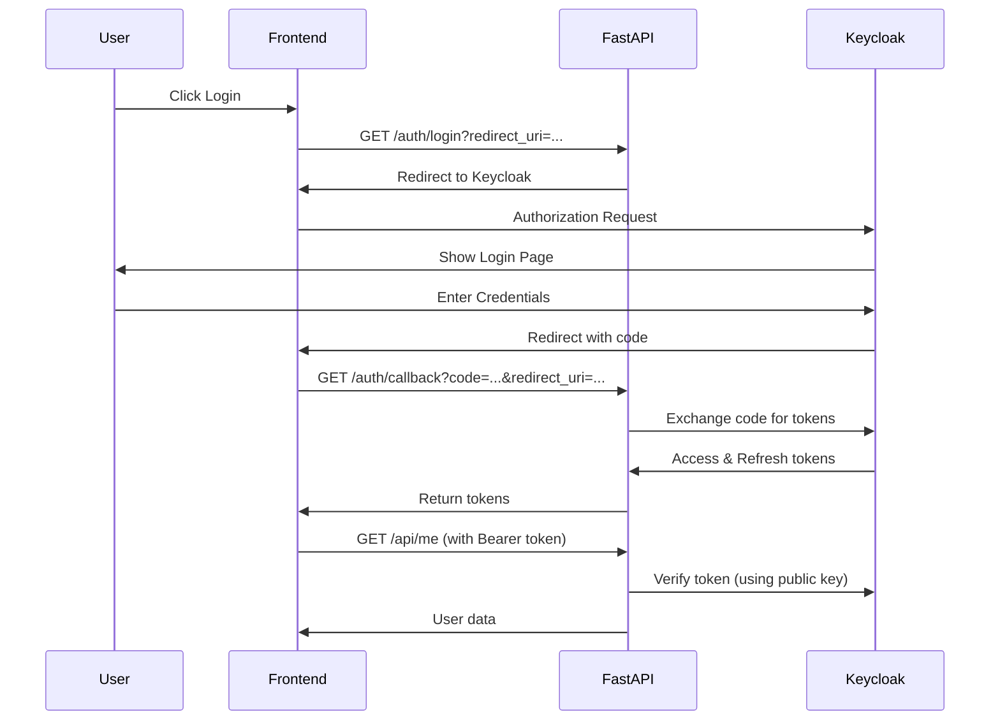
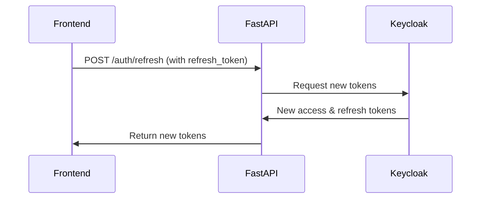

# FastAPI Keycloak Integration

This is a FastAPI application that uses Keycloak as an authorization server for secure authentication.

## Features

- OAuth2/OpenID Connect authentication with Keycloak
- JWT token validation
- Protected endpoints with role-based access control
- Token refresh functionality
- User profile endpoint

## Authentication Flow

The application implements the OAuth 2.0 Authorization Code Flow with OpenID Connect:



### Token Refresh Flow



## Setup

1. Install dependencies:
```bash
pip install -r requirements.txt
```

2. Configure Keycloak:
- Set up a Keycloak server (you can use Docker: `docker run -p 8080:8080 -e KEYCLOAK_ADMIN=admin -e KEYCLOAK_ADMIN_PASSWORD=admin quay.io/keycloak/keycloak:latest start-dev`)
- Create a realm
- Create a client with:
  - Client Protocol: openid-connect
  - Access Type: confidential
  - Valid Redirect URIs: Add your application's redirect URIs
  - Web Origins: Add your application's origins for CORS

3. Configure environment variables:
- Copy `.env.example` to `.env`
- Update the values with your Keycloak configuration:
  - `KEYCLOAK_SERVER_URL`: Your Keycloak server URL (e.g., http://localhost:8080)
  - `KEYCLOAK_REALM_NAME`: Your realm name
  - `KEYCLOAK_CLIENT_ID`: Your client ID
  - `KEYCLOAK_CLIENT_SECRET`: Your client secret (from Keycloak client credentials)

4. Run the application:
```bash
uvicorn app.main:app --reload
```

## API Endpoints

### Public Endpoints

- `GET /` - Root endpoint with API information
- `GET /health` - Health check endpoint
- `GET /docs` - Swagger UI documentation

### Authentication Endpoints

- `GET /auth/login?redirect_uri=<uri>` - Initiate login flow
- `GET /auth/callback?code=<code>&redirect_uri=<uri>` - Handle OAuth callback
- `POST /auth/refresh` - Refresh access token
- `POST /auth/logout` - Logout user

### Protected Endpoints (Require Bearer Token)

- `GET /api/me` - Get current user information
- `GET /api/admin` - Admin-only endpoint (requires 'admin' role)
- `GET /api/user-data` - Get user-specific data

## Usage Example

1. **Initiate Login:**
```bash
# Visit in browser or redirect from your frontend
http://localhost:8000/auth/login?redirect_uri=http://localhost:3000/auth/callback
```

2. **Handle Callback in Frontend:**
After Keycloak authentication, user is redirected to:
```
http://localhost:3000/auth/callback?code=<authorization_code>
```

3. **Exchange Code for Tokens:**
```bash
# Frontend should call this endpoint with the code
GET /auth/callback?code=<code>&redirect_uri=http://localhost:3000/auth/callback
```

4. **Use Access Token for Protected Resources:**
```bash
curl -H "Authorization: Bearer <access_token>" http://localhost:8000/api/me
```

5. **Refresh Token When Expired:**
```bash
curl -X POST http://localhost:8000/auth/refresh \
  -H "Content-Type: application/json" \
  -d '{"refresh_token": "<refresh_token>"}'
```

## Important Notes

- The `redirect_uri` must be registered in Keycloak's "Valid Redirect URIs"
- The same `redirect_uri` must be used in both `/auth/login` and `/auth/callback` calls
- Store tokens securely in your frontend (e.g., httpOnly cookies or secure storage)
- Access tokens typically expire in 5 minutes, use refresh tokens to get new ones

## Development

The project structure:
```
fastapi-keycloak/
├── app/
│   ├── __init__.py
│   ├── main.py
│   ├── config.py
│   ├── routers/
│   │   ├── __init__.py
│   │   ├── auth.py
│   │   └── protected.py
│   ├── services/
│   │   ├── __init__.py
│   │   └── keycloak.py
│   └── middleware/
│       ├── __init__.py
│       └── auth.py
├── .env.example
├── requirements.txt
└── README.md
```

## Keycloak Theme

This project includes a custom Keycloak theme in the `keycloak-theme` directory.

### Theme Structure
```
keycloak-theme/
└── mytheme/
    └── login/
        ├── theme.properties
        ├── login.ftl
        ├── messages/
        │   └── messages_en.properties
        └── resources/
            └── css/
                └── login.css
```

### Deploying the Theme

1. **Copy theme to Keycloak:**
   ```bash
   # For standalone Keycloak
   cp -r keycloak-theme/mytheme /opt/keycloak/themes/

   # For Docker
   docker cp keycloak-theme/mytheme keycloak_container:/opt/keycloak/themes/
   ```

2. **Configure in Keycloak Admin Console:**
   - Go to Realm Settings → Themes
   - Set Login Theme to "mytheme"
   - Save

3. **For Development (Docker Compose):**
   Add volume mount in docker-compose.yml:
   ```yaml
   keycloak:
     image: quay.io/keycloak/keycloak:latest
     volumes:
       - ./keycloak-theme:/opt/keycloak/themes
   ```

### Customizing the Theme

- **Colors & Styles**: Edit `keycloak-theme/mytheme/login/resources/css/login.css`
- **Text & Labels**: Edit `keycloak-theme/mytheme/login/messages/messages_en.properties`
- **HTML Structure**: Edit `keycloak-theme/mytheme/login/login.ftl`

The theme uses CSS variables for easy color customization.